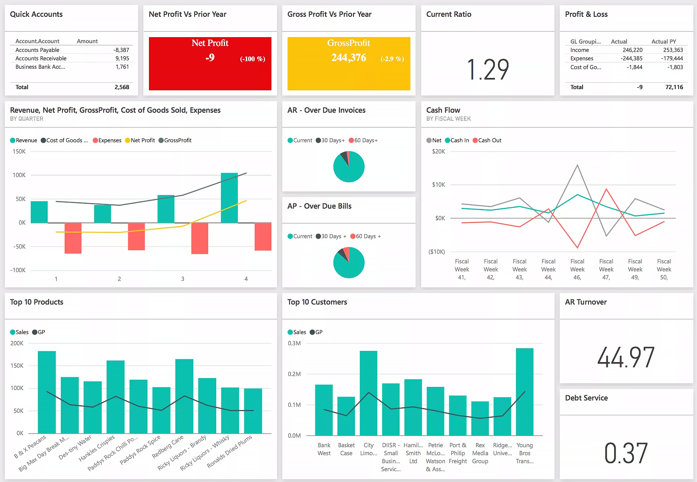

**Visualization Recommendation Systems** 

Data visualization is one of the most important thing in data analysis process. Generally, people trying to plot the data in the form of visualizations to get the insight. 

Several commercial data visualization tools have been proposed. Those tools are trying to make people easier to generate data visualizations, those tools such as Microsoft Power BI, Tableau Software, Qlik. Even, those tools can help user much, however, they are lack of automations. 

In order to address that limitation, several research woks proposed visualization recommendation systems (i.e., VizRec). The goal of VizRec is to automatically recommend top-k most important data visualizations (i.e., insight) from the dataset. Hence, people do not need to doing manual tasks such as selecting and combining attributes one by one to generate visualizations and choosing the important visualizations. 

The example of several research works which focus on VizRec which I mentioned above as follows: 

1. SeeDB:  Efficient Data-Driven Visualization Recommendations to Support Visual Analytics. [paper]( http://www.vldb.org/pvldb/vol8/p2182-vartak.pdf ) . 
2. DiVE: Diversifying View Recommendation for Visual Data Exploration. [paper]( https://dl.acm.org/citation.cfm?id=3271744 ) or [paper](http://ielab.io/publications/mafrur-2018-DiVE) . This is my work. I am still extending this work and this work also part of my thesis. Hence, I will publish the code after I finishing my degree. 
3. DeepEye: Towards Automatic Data Visualization.  [paper](http://dbgroup.cs.tsinghua.edu.cn/ligl/papers/icde18-deepeye.pdf), [demo](http://deepeye.tech/) , [source code](https://github.com/rischanlab/visualization_recommendation_systems/tree/master/DeepEye/APIs_Deepeye)
4. Zenvisage: Effortless Data Exploration with zenvisage: An Expressive and Interactive Visual Analytics System. [paper](http://www.vldb.org/pvldb/vol10/p457-siddiqui.pdf), [demo](https://zenvisage.github.io/), [source code](https://github.com/rischanlab/visualization_recommendation_systems/tree/master/zenvisage)
5. VizML: A Machine Learning Approach to Visualization Recommendation [paper](https://vizml.media.mit.edu/assets/2019-VizML-CHI.pdf), [source code](https://github.com/rischanlab/visualization_recommendation_systems/tree/master/vizml). (this work is not to recommend the most important visualization but the best visualization types that match to the data). This work is really good because we can reproduce this work due to they also give us the corpus. 

I hope this repo can help anyone who want to work on visualization recommendation systems field. I am currently working in this field, so if anyone interested and want to colaborate. Please do not hesitate to contact me through my email r.mafrur [at[] uq [dot] edu [dot] au.

Thank you 

Best Regards, 

Rischan 

* image source:  https://visme.co/blog/business-intelligence-visualization/ 